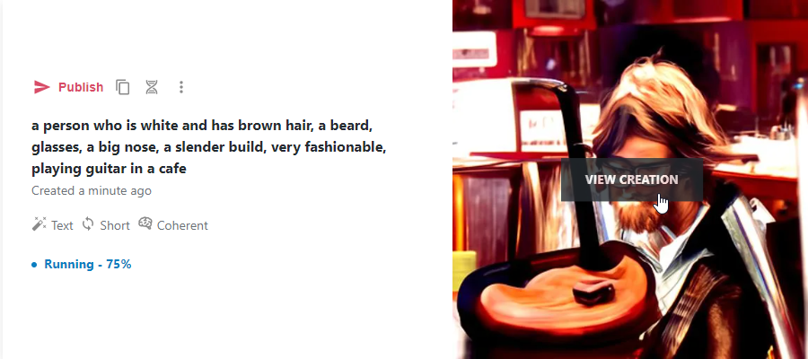
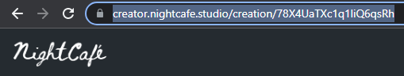

# A.I. Icebreaker
Follow the instructions below to create an A.I-generated profile picture, and share it with the class.

1. Go to this website to start: [https://creator.nightcafe.studio/create/text-to-image](https://creator.nightcafe.studio/create/text-to-image)
1. Under **Your text prompt**, enter a physical description of yourself
    - Try to be as detailed as possible - feel free to describe yourself in an interesting setting or doing something you enjoy!
1. Choose a style, choose an algorithm, and click the **CREATE** button at the bottom
1. Scroll down a little bit to see the art start to render!
1. Hover over the image on the right and click the **VIEW CREATION** button  
    
1. Highlight the URL in the browser address bar and copy it with CTRL+c  
    
1. Now, open up this form: [https://forms.gle/wPr4V2xAKzLSPF3x9](https://forms.gle/wPr4V2xAKzLSPF3x9)
1. Select your room number, enter your full name, and then paste in the link to your created profile picture!